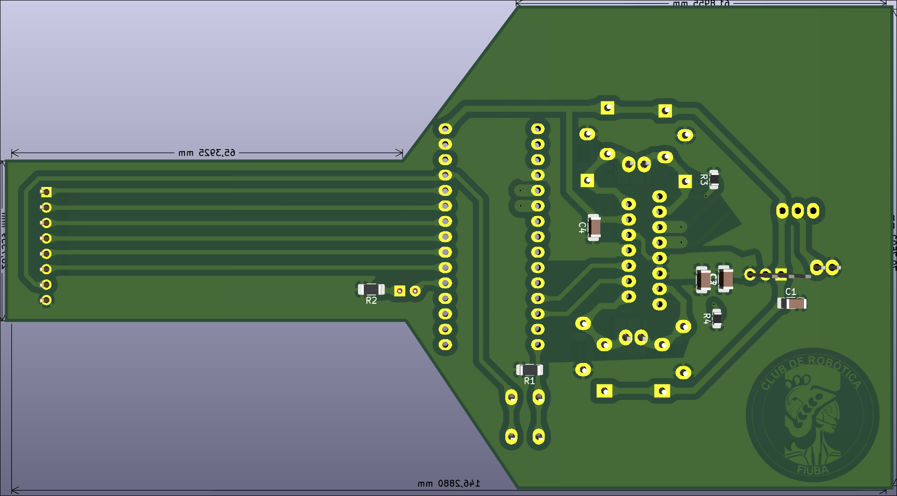

# Modulo Seguidor

Este módulo ejecuta las funciones propias de un seguidor de línea, procesar las lecturas del módulo sensor, e integra el puente H L298N para dirigir los motores.

Vista previa de la placa desde arriba

Vista previa de la placa desde abajo

## Diagrama

El diseño está pensado para hacer la PCB de un solo lado, por lo que las pistas rojas tendrán que reemplazarse con cables.

## TODOs
 - Revisar los footprints de las resistencias y de los capacitores
 - Exportar a un modelo 3D (opcional)
 - ~~Probar en placa separada el modulo puente H~~
