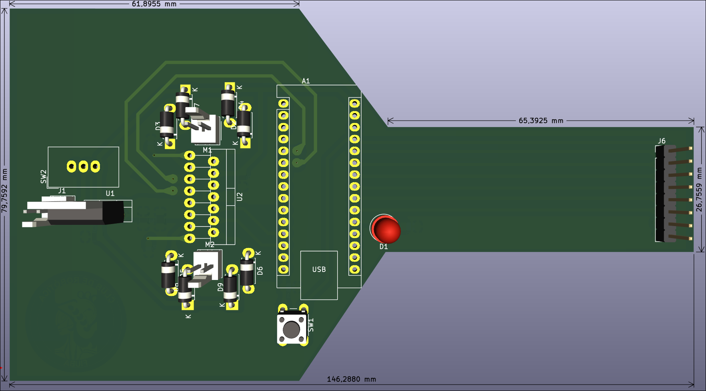

# Modulo Seguidor

Este módulo ejecuta las funciones propias de un seguidor de línea, procesar las lecturas del módulo sensor, e integra el puente H L298N para dirigir los motores.

Vista previa de la placa desde arriba

## Diagrama

## TODOs
 - ~~Revisar las medidas de la placa (tomar en cuenta los bordes de la placa que no tienen agujeros)~~
 - Revisar los footprints de las resistencias y de los capacitores
 - Hacer espacio para la ruedita omnidireccional
 - ~~Acomodar los componentes y hacer las conexiones~~
 - Exportar a un modelo 3D (opcional)
 - ~~Probar en placa separada el modulo puente H~~
 - ~~Reemplazar conexiones de cables por housings~~
